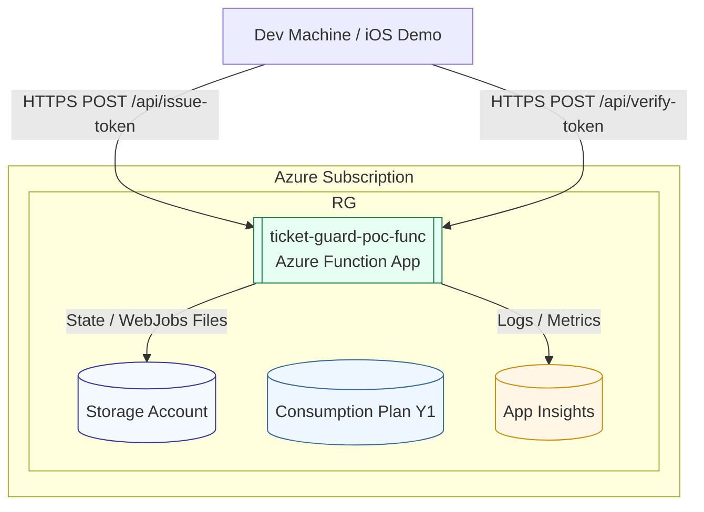
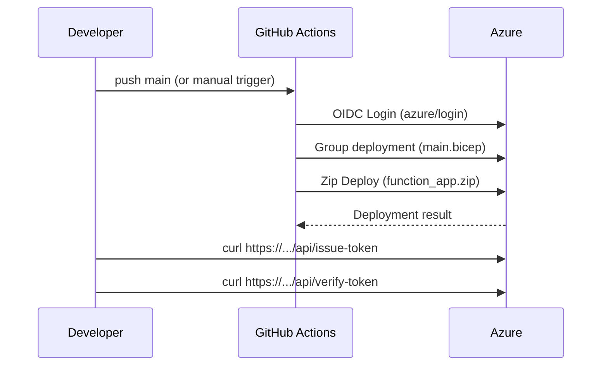

# Ticket Guard Azure Architecture (PoC)

> 状態: Proof of Concept / Disposable. 本書は最小コストで動かし、後から dev/stg/prod へ拡張するための設計スナップショットです。

## 1. ゴール
- HMAC 署名付きトークンの Issue / Verify Azure Functions を最小構成で Azure 上に動かす
- コード (Bicep + GitHub Actions) により再現可能 / いつでも破棄できる
- 将来拡張 (環境分離, Key Vault, Ed25519) の移行パスを明確化

## 2. 全体構成 (Mermaid)


## 3. リソース命名規則 (Environment 先頭: `poc-...`)
PoC であることを一覧性で即判別できるよう、`<env>-<base>` 形式に変更。

| 種別 | 名前 (例) | 旧形式との差分 | 備考 |
|------|-----------|----------------|------|
| Resource Group | `rg-poc-ticket-guard` | `rg-ticket-guard-poc` → env を前へ | 将来 dev/stg/prod は `rg-dev-ticket-guard` 等 |
| Function App | `poc-ticket-guard-func` | `ticket-guard-poc-func` | Bicep: `${environment}-${baseName}-func` |
| Plan (Y1) | `poc-ticket-guard-plan` | `ticket-guard-poc-plan` | 上位 SKU 移行時もプリフィクス維持 |
| Storage | `pocticketguard<6hex>` | `ticketguardpoc<6hex>` | 24 文字制約・小文字・ハイフン除去 |
| App Insights | `poc-ticket-guard-ai` | `ticket-guard-poc-ai` | Unified モード想定 |

Bicep 内部変数例:
```
namePrefix = "${environment}-${baseName}"  # poc-ticket-guard
functionAppName = "${namePrefix}-func"      # poc-ticket-guard-func
```

Bicep パラメータ (PoC):
```
baseName = ticket-guard
environment = poc (固定)
signingSecret = <GitHub Secrets or local export>
purpose = poc
owner = shuji.miyoshi@willer.co.jp
expiresOn = YYYY-MM-DD
```

## 4. タグ設計
| キー | 例 | 用途 |
|------|----|------|
| environment | poc | 稼働段階 (固定) |
| purpose | poc | 稼働目的。production 以外明示 |
| owner | you@example.com | 連絡先/責任者 |
| expiresOn | 2025-10-15 | 破棄判断日 (運用レビュー基準) |
| app | ticket-guard | プロジェクト基軸 |

### 破棄運用
`expiresOn` < 今日 かつ `purpose=poc` → RG ごと削除候補。手順:
```
az group delete -n rg-ticket-guard-poc -y
```

## 5. デプロイフロー (PoC)
Sequence:


## 6. 将来拡張パス
| フェーズ | 追加項目 | 影響 | 移行コスト |
|----------|----------|------|------------|
| +Env 分離 | `environment` を dev/stg/prod に再拡張 | Bicep param allowed 化 | 低 |
| Key Vault | SIGNING_SECRET をシークレット参照 | Bicep に KV 追加 + MSI 権限 | 中 |
| 署名 v2 | Ed25519 キーペア + sigVersion | 発行 & 検証ロジック拡張 | 中 |
| ネットワーク強化 | APIM / Front Door / Private Endpoint | 料金/構成増 | 中〜高 |
| 観測強化 | Log Analytics / アラート | Bicep / Monitor ルール | 低〜中 |

## 7. セキュリティ注意点 (PoC)
- SIGNING_SECRET は必ず GitHub Secrets 経由 (ログ出力禁止)
- Function エンドポイントは匿名公開 → 後で APIM/キー or auth level 変更を検討
- 署名キー rotate: PoC は単純再デプロイで上書き、将来は versioned secret + grace window

## 8. 廃棄チェックリスト
- App Insights に重要ログ無し (export 不要か) を確認
- 残存ダッシュボード/警告設定 無し
- クライアント (iOS Demo) 側ベース URL 変更済 (別環境へ切替)
- RG 削除コマンド実行

## 9. 参考コマンド
### ローカル (一時 secret で)
```bash
export SIGNING_SECRET="$(openssl rand -base64 32)"
az deployment group create \
  --resource-group rg-ticket-guard-poc \
  --template-file infra/main.bicep \
  --parameters baseName=ticket-guard environment=poc \
               signingSecret=$SIGNING_SECRET \
               purpose=poc owner=shuji.miyoshi@willer.co.jp \
               expiresOn=2025-10-15
```

### 動作確認
```bash
ISSUE_ENDPOINT="https://poc-ticket-guard-func.azurewebsites.net/api/issue-token"
VERIFY_ENDPOINT="https://poc-ticket-guard-func.azurewebsites.net/api/verify-token"

curl -s -X POST -H 'Content-Type: application/json' \
  -d '{"ticketId":"EVENT-POC-1","deviceId":"device-abc"}' \
  "$ISSUE_ENDPOINT" | tee issue.json

# 抜き出し & verify
jq '{ticketId,deviceId,startAtEpochSec,ttlSec,nonce,sig}' issue.json > verify.json
curl -s -X POST -H 'Content-Type: application/json' -d @verify.json "$VERIFY_ENDPOINT"
```

## 10. 今後この文書を更新するトリガ例
- 環境追加 (dev/stg/prod) → Naming テーブル再生成
- Key Vault 導入 → セクション 5 に Secret 解決フロー追記
- 署名バージョン追加 → API レスポンス例更新

---
この PoC 設計で追加・修正したい点があればコメントしてください。次は必要であれば `DEPLOYMENT.md` へ要約を統合できます。
